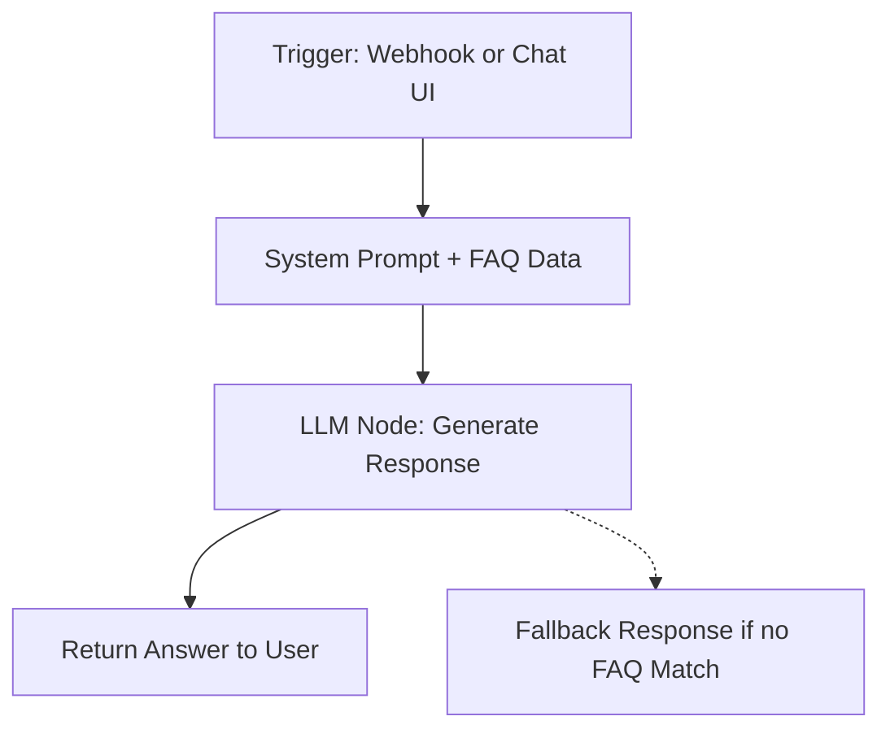

### Doctor’s Appointment Chatbot Workflow for n8n

This repository contains the Doctor’s Appointment Chatbot Workflow for use with n8n.
It provides a simple FAQ-based chatbot that helps patients with common appointment-related questions such as scheduling, rescheduling, cancellations, insurance, and telehealth.

The chatbot runs on n8n and uses a system prompt + FAQ knowledge base to provide focused, reliable answers.

## Getting Started

1. Download the appointment_chatbot.json file.

2. Import it into your n8n instance using the workflow import tool.

3. Configure Credentials by setting up your API credentials (e.g., OpenAI, Gemini, or any other LLM service) in the respective nodes or update the connection details if using a Webhook trigger.

## Requirements

1. A running n8n instance

2. API credentials for the language model you want to use (e.g., OpenAI API Key or Gemini API Key)

3. (Optional) Web server / reverse proxy for hosting webhook endpoints

## Features

1. Provides answers to doctor’s appointment FAQs (scheduling, cancellations, insurance, telehealth, etc.).

2. Uses a structured system prompt to stay focused on appointment-related support.

3. Includes a fallback response when the answer is not in the source data.

4. Easily extendable with more FAQ data or clinic-specific workflows.

## Customization

1. Modify the system prompt to reflect your clinic’s policies and FAQs.

2. Add integration with clinic systems (e.g., EHR, scheduling software) for real-time updates.

3. Adjust the fallback response to redirect patients to phone numbers, email, or a live agent.

## Workflow Overview

**Trigger Node** – Listens for incoming requests (chat messages, webhook, or UI input).

**System Prompt** – Defines the chatbot’s role, persona, and FAQ data.

**LLM Node** – Generates responses based on the FAQ knowledge base.

**Response Node** – Returns the chatbot’s answer to the user.

**Fallback Response** – If the question is outside the FAQ scope, the chatbot redirects to clinic support.

## Deployment

You can deploy the chatbot in multiple ways:

1. Webhook Trigger → Expose an endpoint for integration into websites, portals, or chat widgets.

2. Messenger / Chatbot Integration → Connect to WhatsApp, Telegram, or website chatbots using n8n connectors.

3. Internal Use → Embed in staff-facing systems for answering patient queries quickly.

## Testing

Test locally in n8n Editor before going live.

Use sample FAQ questions such as:

*“How do I reschedule my appointment?”*

*“What should I bring to my visit?”*

*“Do you offer telehealth?”*

## Troubleshooting

**No response?** → Check your webhook URL and ensure the workflow is active.

**Invalid credentials?** → Reconfigure your API key in the workflow settings.

**Out-of-scope questions?** → Verify the fallback response is configured correctly.

## Security Notes

Do not hardcode credentials inside nodes — use n8n credentials manager.

Use HTTPS for webhook endpoints to protect patient data.

**Keep in mind: This chatbot is for informational purposes only and must not provide medical advice.**

## Additional Customizations

1. Add multi-language support for diverse patient groups.

2. Connect to SMS/email reminders for appointment confirmations.

3. Enhance with patient authentication for personalized responses.